```{r setup, include=FALSE}
options(htmltools.dir.version = FALSE)
```

class: center, middle

# ¡Hola!

```{r init, echo=FALSE, fig.align="center", out.width='45%'}
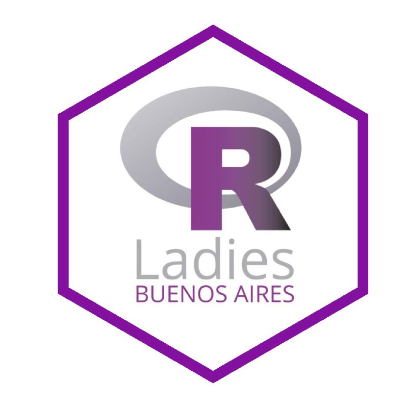
```


---

background-image: url("https://media.giphy.com/media/3o7abBphHJngINCHio/source.gif")
background-position: 50% 50%
class: center, inverse

# ¿Qué es R-Ladies?


---

class: center, inverse, middle

# ¿Qué queremos?


Promover la Diversidad de Género en la comunidad R 


---

class: center

# Organizan

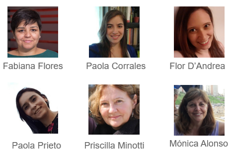


---

class: center

# Colaboran


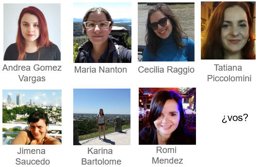


---
class: center, middle

# Sponsors


---

class: center, inverse, middle
background-image: url("brisho.jpg")

# Anuario 2019
# R-Ladies Buenos Aires

---

class: center, middle

# Comunidades amigas

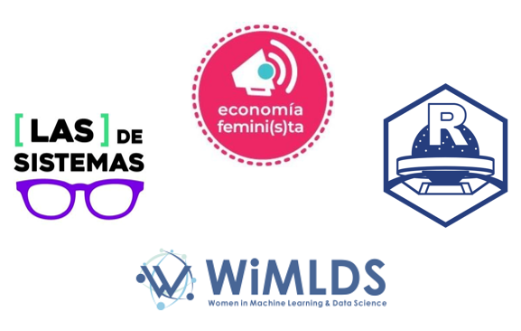

---

class: center, middle

# Redes


---

class: center, middle
# Instagram

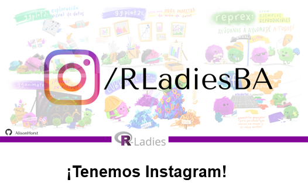

---

class: center, middle
# Flisol

Festival Latinoamericano de Instalación de Software Libre

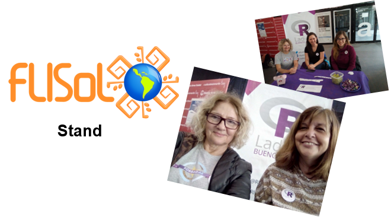

---

class: center, middle

# FOSSAG-AR

Conferencia de Geomática Libre

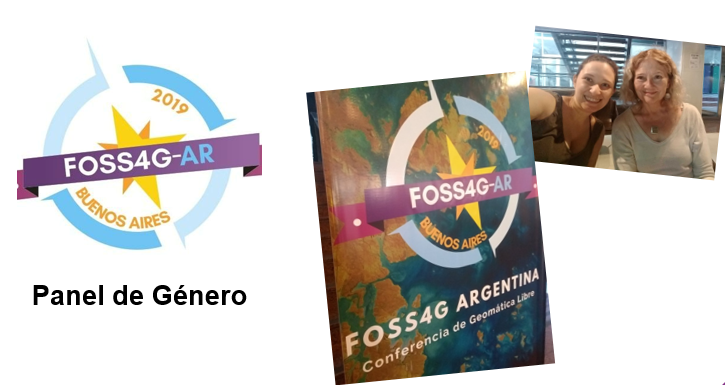

---

class: center, middle


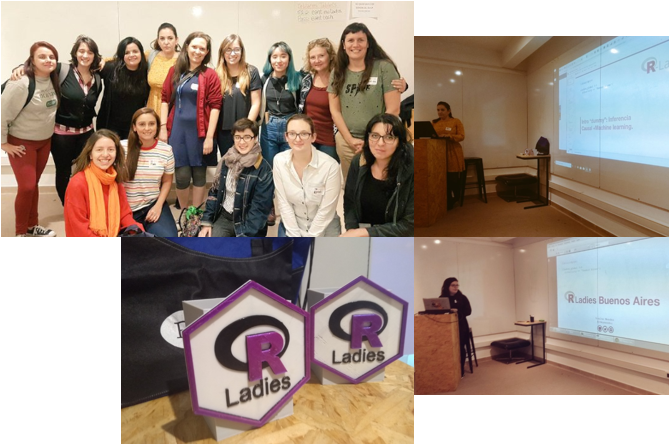

---

class: center, middle


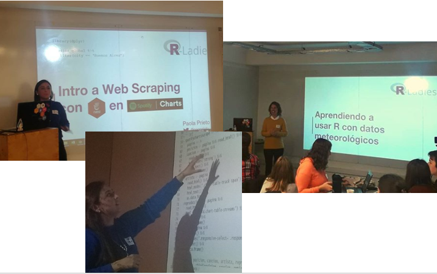
---

class: center


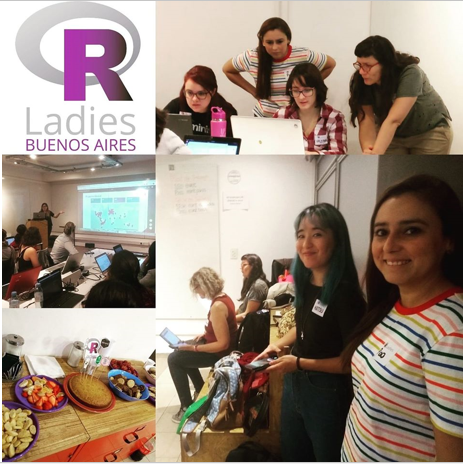


---

class: center

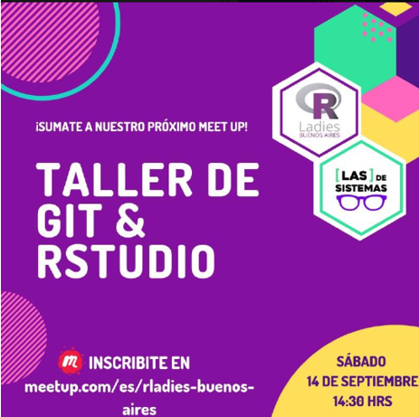


---
class: center, middle

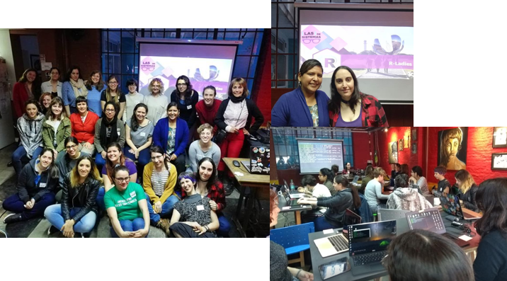

---

class: center

# LatinR
Conferencia Latinoamericana sobre Uso de R en Investigación + Desarrollo


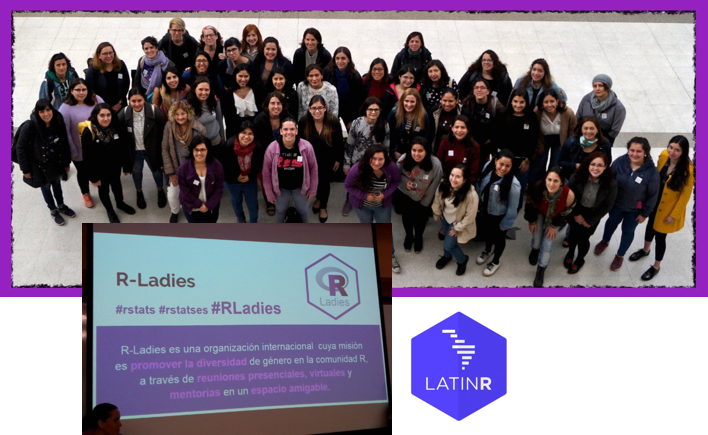


---

class: center


---

class: center

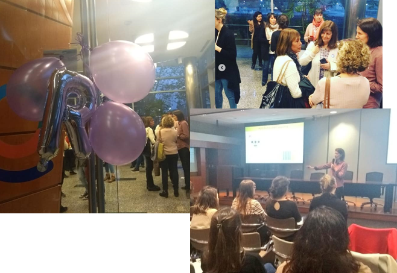
---

class: center

# Nerdearla

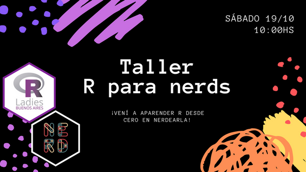

---

class: center

# HOY

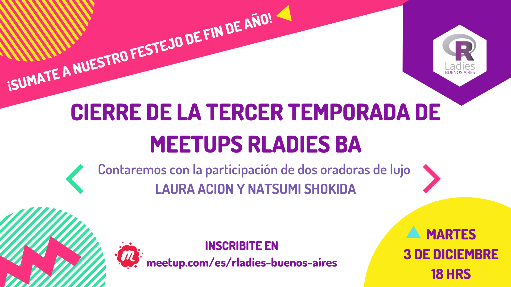

---

class: inverse, center, middle

# Copate

<a href="mailto:buenosaires@rladies.org"><i class="fa fa-envelope"></i>&nbsp; buenosaires@rladies.org</a>

<a href="https://www.meetup.com/es-ES/rladies-buenos-aires/"><i class="fa fa-meetup"></i>&nbsp; rladies-buenos-aires</a>

<a href="https://www.facebook.com/RladiesBA"><i class="fa fa-facebook-official"></i>&nbsp; RladiesBA </a>

<a href="http://twitter.com/rladiesBA"><i class="fa fa-twitter fa-fw"></i>&nbsp; @rladiesBA</a>

<a href="https://www.instagram.com/rladiesba/"><i class="fa fa-instagram"></i>&nbsp; rladiesba</a>

<a href="https://github.com/rladies/meetup-presentations_buenosaires"><i class="fa fa-github fa-fw"></i>&nbsp; @meetup-presentations_buenosaires</a>

---

class: center, inverse


# Abrir un capítulo


<a href="mailto:info@rladies.org"><i class="fa fa-envelope"></i>&nbsp; info@rladies.org </a>


---


class: center, inverse, middle

# R-Ladies Community
### Iniciativas R-Ladies Global (Slack)

https://rladies-community-slack.herokuapp.com/


---

class: inverse, center, middle

### Iniciativas R-Ladies Global (Twitter)

<a href="https://twitter.com/RLadiesGlobal"><i class="fa fa-twitter fa-fw"></i>&nbsp; @rladiesGlobal</a><br>

<a href="https://twitter.com/rladies_iwd"><i class="fa fa-twitter fa-fw"></i>&nbsp; R-Ladies International Women's Day </a><br>

<a href="https://twitter.com/WeAreRLadies"><i class="fa fa-twitter fa-fw"></i>&nbsp; We are R-Ladies </a><br>


---


class: center, inverse, middle
background-image: url("brisho.jpg")

# ¡Muchas Gracias!


